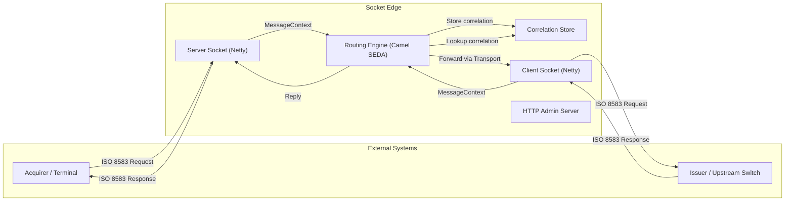
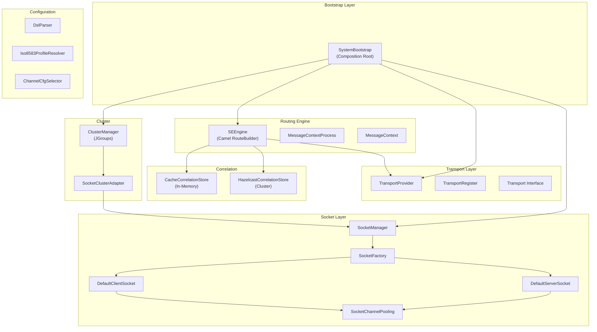
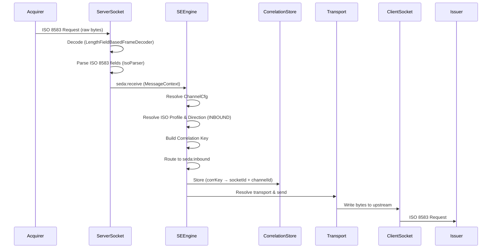
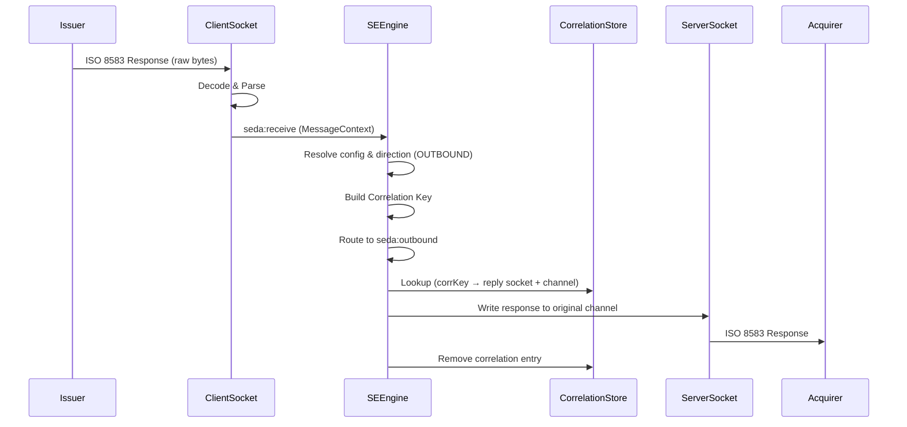

# Socket Edge — Application Documentation

## 1. Overview

**Socket Edge** is a high-performance **ISO 8583 message switch/router** built in **Java 21**. It acts as a TCP proxy that receives ISO 8583 financial transaction messages on server sockets, routes them through an internal processing pipeline, and forwards them to upstream systems via client sockets. Responses are correlated back to the original requester using a request–response correlation store.

The application is designed for the **payment switching** domain (Jalin Pembayaran Nusantara) and supports both **standalone** and **active–passive clustered** deployment modes.

---

## 2. Technology Stack

| Layer | Technology | Version |
|---|---|---|
| Language | Java | 21 |
| Network I/O | Netty | 4.1.112 |
| Routing Engine | Apache Camel | 4.14.0 |
| ISO 8583 Parsing | jPOS | 2.1.9 |
| Cluster Communication | JGroups | 5.3.3 |
| Distributed Cache | Hazelcast | — |
| Metrics | Micrometer (JMX) | 1.12.3 |
| Configuration | Typesafe Config (HOCON) | 1.4.3 |
| Build | Maven | — |

---

## 3. Architecture

### 3.1 High-Level Architecture



### 3.2 Component Architecture



---

## 4. Startup Flow

The [SystemBootstrap](file:///c:/Users/yohanes.kusumo/OneDrive%20-%20Jalin%20Pembayaran%20Nusantara/1.%20Apps/1.%20GitApp/23.%20socket-edge-dev/socket-edge-dev/socket-edge-dev/src/main/java/com/socket/edge/SystemBootstrap.java) class is the composition root and entry point ([main](file:///c:/Users/yohanes.kusumo/OneDrive%20-%20Jalin%20Pembayaran%20Nusantara/1.%20Apps/1.%20GitApp/23.%20socket-edge-dev/socket-edge-dev/socket-edge-dev/src/main/java/com/socket/edge/SystemBootstrap.java#556-577)):

| Step | Method | Description |
|---|---|---|
| 1 | [loadSystemConfiguration()](file:///c:/Users/yohanes.kusumo/OneDrive%20-%20Jalin%20Pembayaran%20Nusantara/1.%20Apps/1.%20GitApp/23.%20socket-edge-dev/socket-edge-dev/socket-edge-dev/src/main/java/com/socket/edge/SystemBootstrap.java#242-310) | Loads and validates [system.conf](file:///c:/Users/yohanes.kusumo/OneDrive%20-%20Jalin%20Pembayaran%20Nusantara/1.%20Apps/1.%20GitApp/23.%20socket-edge-dev/socket-edge-dev/socket-edge-dev/src/main/resources/conf/system.conf) and [cluster.conf](file:///c:/Users/yohanes.kusumo/OneDrive%20-%20Jalin%20Pembayaran%20Nusantara/1.%20Apps/1.%20GitApp/23.%20socket-edge-dev/socket-edge-dev/socket-edge-dev/src/main/resources/conf/cluster.conf) using Typesafe Config with schema validation |
| 2 | [initializeObject()](file:///c:/Users/yohanes.kusumo/OneDrive%20-%20Jalin%20Pembayaran%20Nusantara/1.%20Apps/1.%20GitApp/23.%20socket-edge-dev/socket-edge-dev/socket-edge-dev/src/main/java/com/socket/edge/SystemBootstrap.java#311-347) | Creates core objects: `Iso8583ProfileResolver`, [TransportProvider](file:///c:/Users/yohanes.kusumo/OneDrive%20-%20Jalin%20Pembayaran%20Nusantara/1.%20Apps/1.%20GitApp/23.%20socket-edge-dev/socket-edge-dev/socket-edge-dev/src/main/java/com/socket/edge/core/transport/TransportProvider.java#30-159), [CorrelationStore](file:///c:/Users/yohanes.kusumo/OneDrive%20-%20Jalin%20Pembayaran%20Nusantara/1.%20Apps/1.%20GitApp/23.%20socket-edge-dev/socket-edge-dev/socket-edge-dev/src/main/java/com/socket/edge/core/engine/SEEngine.java#137-148) (in-memory), `TelemetryRegistry` (JMX or Simple) |
| 3 | [loadChannelConfiguration()](file:///c:/Users/yohanes.kusumo/OneDrive%20-%20Jalin%20Pembayaran%20Nusantara/1.%20Apps/1.%20GitApp/23.%20socket-edge-dev/socket-edge-dev/socket-edge-dev/src/main/java/com/socket/edge/SystemBootstrap.java#348-364) | Loads the ISO 8583 packager XML, parses [channel.conf](file:///c:/Users/yohanes.kusumo/OneDrive%20-%20Jalin%20Pembayaran%20Nusantara/1.%20Apps/1.%20GitApp/23.%20socket-edge-dev/socket-edge-dev/socket-edge-dev/src/main/resources/conf/channel.conf) DSL, and builds runtime `Metadata` |
| 4 | [handleRouterEngine()](file:///c:/Users/yohanes.kusumo/OneDrive%20-%20Jalin%20Pembayaran%20Nusantara/1.%20Apps/1.%20GitApp/23.%20socket-edge-dev/socket-edge-dev/socket-edge-dev/src/main/java/com/socket/edge/SystemBootstrap.java#365-385) | Creates `DefaultCamelContext` with virtual thread pool, adds [SEEngine](file:///c:/Users/yohanes.kusumo/OneDrive%20-%20Jalin%20Pembayaran%20Nusantara/1.%20Apps/1.%20GitApp/23.%20socket-edge-dev/socket-edge-dev/socket-edge-dev/src/main/java/com/socket/edge/core/engine/SEEngine.java#63-358) routes, starts Camel |
| 5 | [handleSocketConfiguration()](file:///c:/Users/yohanes.kusumo/OneDrive%20-%20Jalin%20Pembayaran%20Nusantara/1.%20Apps/1.%20GitApp/23.%20socket-edge-dev/socket-edge-dev/socket-edge-dev/src/main/java/com/socket/edge/SystemBootstrap.java#386-412) | Creates [SocketManager](file:///c:/Users/yohanes.kusumo/OneDrive%20-%20Jalin%20Pembayaran%20Nusantara/1.%20Apps/1.%20GitApp/23.%20socket-edge-dev/socket-edge-dev/socket-edge-dev/src/main/java/com/socket/edge/core/socket/SocketManager.java#15-328)/`SocketFactory`, binds to engine, creates sockets from config, starts all sockets (or cluster) |
| 6 | [handleHttpServer()](file:///c:/Users/yohanes.kusumo/OneDrive%20-%20Jalin%20Pembayaran%20Nusantara/1.%20Apps/1.%20GitApp/23.%20socket-edge-dev/socket-edge-dev/socket-edge-dev/src/main/java/com/socket/edge/SystemBootstrap.java#488-503) | Starts embedded Netty HTTP admin server |
| 7 | [handleLifecycle()](file:///c:/Users/yohanes.kusumo/OneDrive%20-%20Jalin%20Pembayaran%20Nusantara/1.%20Apps/1.%20GitApp/23.%20socket-edge-dev/socket-edge-dev/socket-edge-dev/src/main/java/com/socket/edge/SystemBootstrap.java#513-555) | Registers JVM shutdown hook for graceful shutdown |

---

## 5. Message Flow

### 5.1 Inbound Flow (Request: Acquirer → Issuer)



### 5.2 Outbound Flow (Response: Issuer → Acquirer)



---

## 6. Key Components

### 6.1 SEEngine (Routing Engine)

[SEEngine.java](file:///c:/Users/yohanes.kusumo/OneDrive%20-%20Jalin%20Pembayaran%20Nusantara/1.%20Apps/1.%20GitApp/23.%20socket-edge-dev/socket-edge-dev/socket-edge-dev/src/main/java/com/socket/edge/core/engine/SEEngine.java) extends Camel `RouteBuilder` and defines 4 SEDA routes:

| Route | Purpose | Consumers |
|---|---|---|
| `seda:receive` | Entry point — resolves config, profile, direction, correlation key | 8 (configurable) |
| `seda:inbound` | Stores correlation, dispatches to transport/client socket | 8 |
| `seda:outbound` | Looks up correlation, replies to original server socket channel | 8 |
| `seda:unknown` | Logs unrecognized message direction | 1 |

Uses **Java 21 Virtual Threads** via [VirtualThreadPoolFactory](file:///c:/Users/yohanes.kusumo/OneDrive%20-%20Jalin%20Pembayaran%20Nusantara/1.%20Apps/1.%20GitApp/23.%20socket-edge-dev/socket-edge-dev/socket-edge-dev/src/main/java/com/socket/edge/core/VirtualThreadPoolFactory.java#11-35) for Camel's thread pools.

### 6.2 Socket Layer

- **DefaultServerSocket** — Netty `ServerBootstrap` that listens on a TCP port, accepts connections, and decodes incoming ISO 8583 messages using `LengthFieldBasedFrameDecoder`
- **DefaultClientSocket** — Netty [Bootstrap](file:///c:/Users/yohanes.kusumo/OneDrive%20-%20Jalin%20Pembayaran%20Nusantara/1.%20Apps/1.%20GitApp/23.%20socket-edge-dev/socket-edge-dev/socket-edge-dev/src/main/java/com/socket/edge/SystemBootstrap.java#95-587) that connects to upstream endpoints with **automatic reconnection** (exponential backoff)
- **SocketChannelPooling** — Thread-safe channel pool with endpoint-based indexing, allowlist filtering, and version tracking
- **SocketFactory** — Factory for creating server/client sockets with proper wiring

### 6.3 Correlation Store

Two implementations:
- **CacheCorrelationStore** — In-memory `ConcurrentHashMap` with TTL-based eviction (lazy + periodic cleanup). Used in standalone mode.
- **HazelcastCorrelationStore** — Distributed map via Hazelcast. Used in cluster mode.

### 6.4 Load Balancing Strategies

- **RoundRobinStrategy** — Weighted round-robin with priority-based filtering and version-cached routing cycle
- **LeastConnectionStrategy** — Routes to the endpoint with the fewest active connections
- **HashStrategy** — Hash-based sticky routing using ISO fields

### 6.5 Cluster Mode

Uses **JGroups** for leader election and **Hazelcast** for distributed correlation store:

| Feature | Technology |
|---|---|
| Leader Election | JGroups (coordinator = MASTER) |
| State Replication | Hazelcast IMap |
| Failover | Automatic role promotion via [ClusterManager](file:///c:/Users/yohanes.kusumo/OneDrive%20-%20Jalin%20Pembayaran%20Nusantara/1.%20Apps/1.%20GitApp/23.%20socket-edge-dev/socket-edge-dev/socket-edge-dev/src/main/java/com/socket/edge/core/cluster/ClusterManager.java#52-251) |

State machine: `STARTING → PROMOTING → MASTER` or `STARTING → SLAVE`

---

## 7. Configuration

### 7.1 system.conf (HOCON format)

Defines server name, port, ISO 8583 packager path, engine cache TTL, and SEDA queue settings (consumers, queue-size, block-when-full).

### 7.2 channel.conf (Custom DSL)

Custom DSL parsed by [DslParser.java](file:///c:/Users/yohanes.kusumo/OneDrive%20-%20Jalin%20Pembayaran%20Nusantara/1.%20Apps/1.%20GitApp/23.%20socket-edge-dev/socket-edge-dev/socket-edge-dev/src/main/java/com/socket/edge/utils/DslParser.java):

```
channel {
    name <channel-name>
    type tcp

    server {
        listen <host> <port>
        pool <host> [port <port>] [weight <w>] [priority <p>] [maxfails <n>] [failtimeout <s>]
    }

    client {
        connect <host> <port> [weight <w>] [priority <p>] [maxfails <n>] [failtimeout <s>]
        strategy roundrobin | leastconn | hash
    }

    profile <profile-name>
}

profile <name> {
    direction inbound {
        de1 in ["0800", "0200", "0420"]
    }
    direction outbound {
        de1 in ["0810", "0210", "0430"]
    }
    correlation {
        de2
        de11
        de37
    }
}
```

### 7.3 cluster.conf (HOCON format)

Defines cluster name, JGroups config path, role preference (master/slave/auto), strict mode, member IPs, bind address, and ports.

---

## 8. HTTP Admin API

Embedded Netty HTTP server (port 9001 by default) with endpoints:

| Endpoint | Handler | Description |
|---|---|---|
| `/queue` | QueueServiceHttpHandler | View SEDA queue status |
| `/metrics` | MetricsHttpHandler | View Micrometer metrics |
| `/health` | HealthCheckHttpHandler | Health check with socket/cluster status |
| `/cache` | GetCacheHttpHandler | View correlation cache entries |
| `/config/reload` | ConfigServiceHandler | Hot-reload channel configuration |
| `/socket/*` | SocketControlHandler | Socket management (start/stop/restart) |

---

## 9. Project Structure

```
src/main/java/com/socket/edge/
├── SystemBootstrap.java           # Main entry point & composition root
├── constant/                      # Enums (Direction, SocketState, NodeRole, etc.)
├── core/
│   ├── engine/SEEngine.java       # Camel routing engine
│   ├── socket/                    # Netty socket layer
│   │   ├── DefaultServerSocket    # TCP server socket
│   │   ├── DefaultClientSocket    # TCP client socket
│   │   ├── SocketManager          # Socket lifecycle manager
│   │   ├── SocketChannelPooling   # Channel pool with endpoint indexing
│   │   └── SocketFactory          # Socket creation factory
│   ├── transport/                 # Message delivery abstraction
│   ├── cluster/                   # JGroups cluster management
│   ├── cache/                     # Correlation store implementations
│   ├── strategy/                  # Load balancing strategies
│   └── iso/                       # ISO 8583 profile resolver
├── http/                          # HTTP admin server & handlers
├── model/                         # Data models & records
├── simulator/                     # Test simulators (Netty client/server)
└── utils/                         # DSL parser, ISO parser, utilities
```
