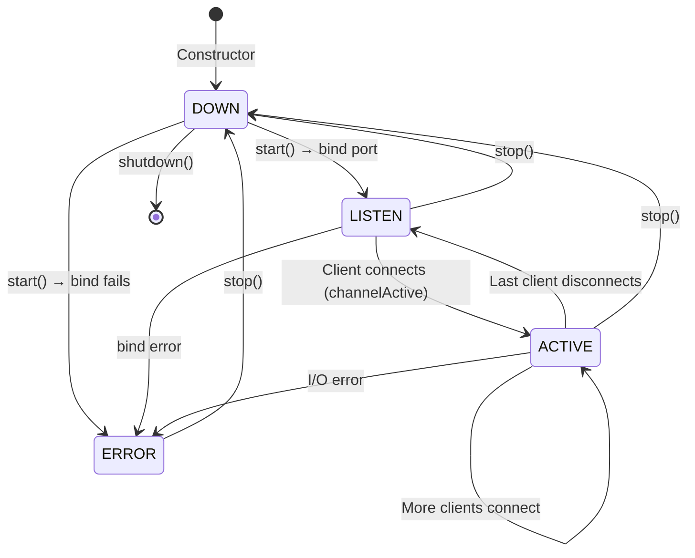
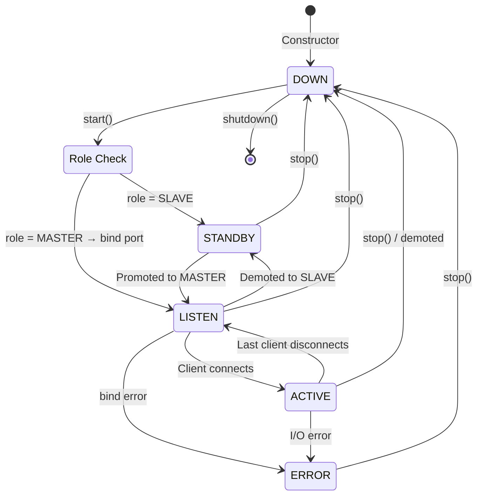
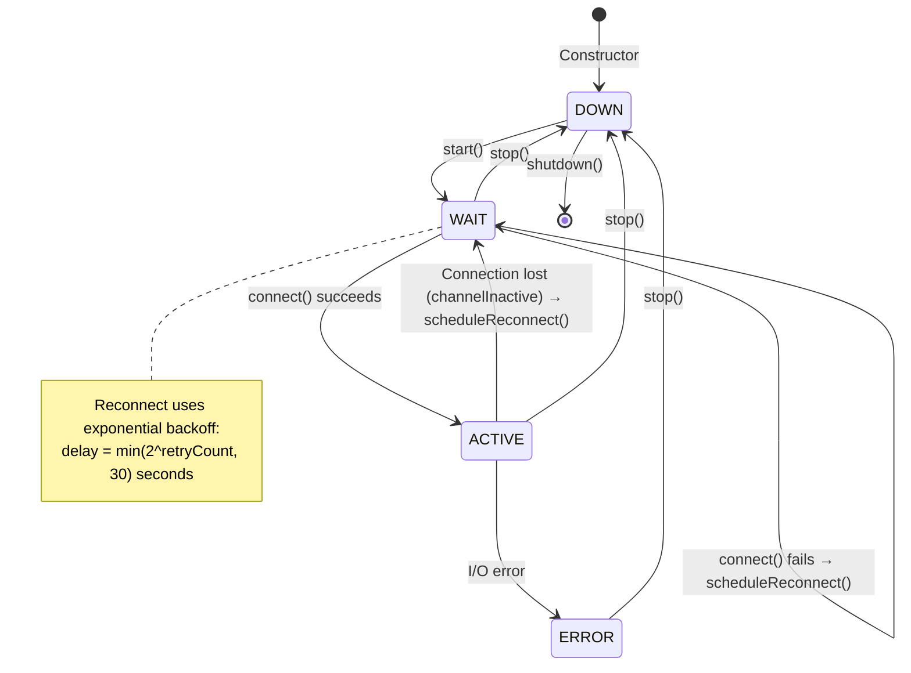
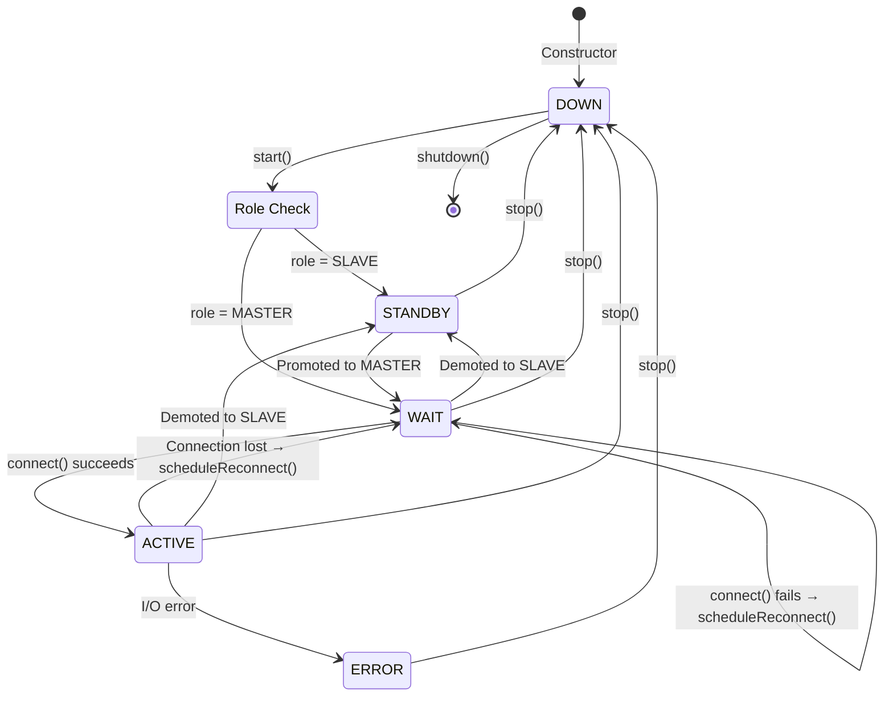
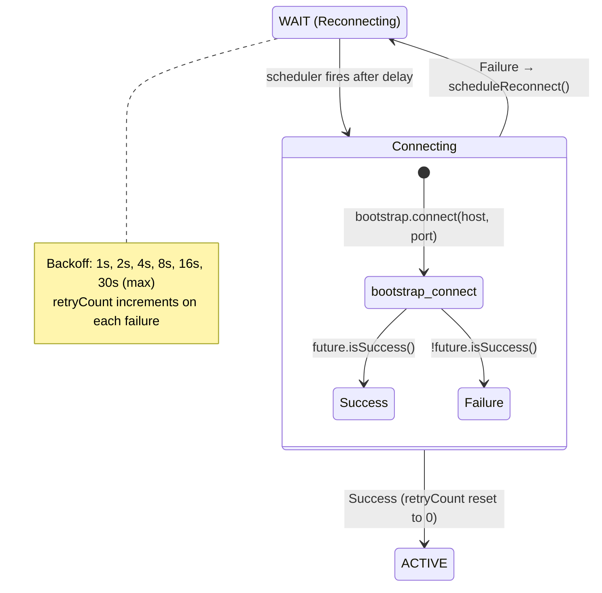
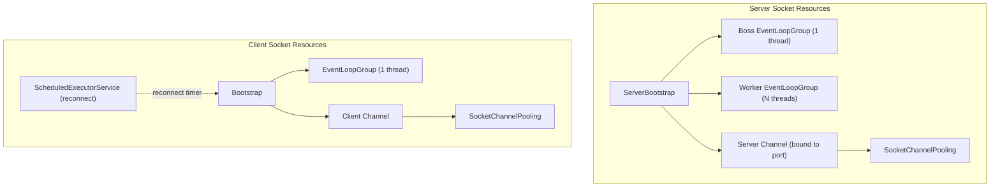

# Socket Edge — Socket Lifecycle State Diagrams

## Socket States

| State | Description | Traffic Allowed |
|---|---|---|
| `DOWN` | Socket is fully disconnected, no resources active | ❌ |
| `STANDBY` | Initialized but inactive (cluster SLAVE mode) | ❌ |
| `LISTEN` | Server socket bound and accepting connections | ❌ (server only) |
| `WAIT` | Client socket waiting for connection establishment | ❌ (client only) |
| `ACTIVE` | Fully connected and processing transactions | ✅ |
| `ERROR` | Unrecoverable error, requires recovery | ❌ |

Source: [SocketState.java](file:///c:/Users/yohanes.kusumo/OneDrive%20-%20Jalin%20Pembayaran%20Nusantara/1.%20Apps/1.%20GitApp/23.%20socket-edge-dev/socket-edge-dev/socket-edge-dev/src/main/java/com/socket/edge/constant/SocketState.java)

---

## 1. Server Socket Lifecycle

### 1.1 Standalone Mode

### 1.2 Cluster Mode

### 1.3 Transition Table

| From | To | Trigger | Code Reference |
|---|---|---|---|
| `DOWN` | `LISTEN` | [start()](file:///c:/Users/yohanes.kusumo/OneDrive%20-%20Jalin%20Pembayaran%20Nusantara/1.%20Apps/1.%20GitApp/23.%20socket-edge-dev/socket-edge-dev/socket-edge-dev/src/main/java/com/socket/edge/http/NettyHttpServer.java#36-61) → [startServer()](file:///c:/Users/yohanes.kusumo/OneDrive%20-%20Jalin%20Pembayaran%20Nusantara/1.%20Apps/1.%20GitApp/23.%20socket-edge-dev/socket-edge-dev/socket-edge-dev/src/main/java/com/socket/edge/core/socket/DefaultServerSocket.java#209-263) → [bind(port).sync()](file:///c:/Users/yohanes.kusumo/OneDrive%20-%20Jalin%20Pembayaran%20Nusantara/1.%20Apps/1.%20GitApp/23.%20socket-edge-dev/socket-edge-dev/socket-edge-dev/src/main/java/com/socket/edge/core/socket/SocketFactory.java#80-93) succeeds | [L184–206](file:///c:/Users/yohanes.kusumo/OneDrive%20-%20Jalin%20Pembayaran%20Nusantara/1.%20Apps/1.%20GitApp/23.%20socket-edge-dev/socket-edge-dev/socket-edge-dev/src/main/java/com/socket/edge/core/socket/DefaultServerSocket.java#L184-L206) |
| `DOWN` | `STANDBY` | [start()](file:///c:/Users/yohanes.kusumo/OneDrive%20-%20Jalin%20Pembayaran%20Nusantara/1.%20Apps/1.%20GitApp/23.%20socket-edge-dev/socket-edge-dev/socket-edge-dev/src/main/java/com/socket/edge/http/NettyHttpServer.java#36-61) when `role ≠ MASTER` (cluster mode) | [L204](file:///c:/Users/yohanes.kusumo/OneDrive%20-%20Jalin%20Pembayaran%20Nusantara/1.%20Apps/1.%20GitApp/23.%20socket-edge-dev/socket-edge-dev/socket-edge-dev/src/main/java/com/socket/edge/core/socket/DefaultServerSocket.java#L204) |
| `LISTEN` | `ACTIVE` | Client TCP connection accepted (`channelActive` in pipeline) | `ChannelInboundAdapter.channelActive()` |
| `LISTEN/ACTIVE` | `DOWN` | [stop()](file:///c:/Users/yohanes.kusumo/OneDrive%20-%20Jalin%20Pembayaran%20Nusantara/1.%20Apps/1.%20GitApp/23.%20socket-edge-dev/socket-edge-dev/socket-edge-dev/src/main/java/com/socket/edge/http/NettyHttpServer.java#62-66) → closes all channels, unbinds port | [L268–289](file:///c:/Users/yohanes.kusumo/OneDrive%20-%20Jalin%20Pembayaran%20Nusantara/1.%20Apps/1.%20GitApp/23.%20socket-edge-dev/socket-edge-dev/socket-edge-dev/src/main/java/com/socket/edge/core/socket/DefaultServerSocket.java#L268-L289) |
| Any | `ERROR` | Exception during [bind()](file:///c:/Users/yohanes.kusumo/OneDrive%20-%20Jalin%20Pembayaran%20Nusantara/1.%20Apps/1.%20GitApp/23.%20socket-edge-dev/socket-edge-dev/socket-edge-dev/src/main/java/com/socket/edge/core/socket/SocketFactory.java#80-93) or I/O | [L257](file:///c:/Users/yohanes.kusumo/OneDrive%20-%20Jalin%20Pembayaran%20Nusantara/1.%20Apps/1.%20GitApp/23.%20socket-edge-dev/socket-edge-dev/socket-edge-dev/src/main/java/com/socket/edge/core/socket/DefaultServerSocket.java#L257) |
| `DOWN` | (destroyed) | [shutdown()](file:///c:/Users/yohanes.kusumo/OneDrive%20-%20Jalin%20Pembayaran%20Nusantara/1.%20Apps/1.%20GitApp/23.%20socket-edge-dev/socket-edge-dev/socket-edge-dev/src/main/java/com/socket/edge/core/socket/DefaultServerSocket.java#292-312) → releases boss/worker event loops | [L299–311](file:///c:/Users/yohanes.kusumo/OneDrive%20-%20Jalin%20Pembayaran%20Nusantara/1.%20Apps/1.%20GitApp/23.%20socket-edge-dev/socket-edge-dev/socket-edge-dev/src/main/java/com/socket/edge/core/socket/DefaultServerSocket.java#L299-L311) |

---

## 2. Client Socket Lifecycle

### 2.1 Standalone Mode

### 2.2 Cluster Mode

### 2.3 Reconnect Cycle Detail

### 2.4 Transition Table

| From | To | Trigger | Code Reference |
|---|---|---|---|
| `DOWN` | `WAIT` | [start()](file:///c:/Users/yohanes.kusumo/OneDrive%20-%20Jalin%20Pembayaran%20Nusantara/1.%20Apps/1.%20GitApp/23.%20socket-edge-dev/socket-edge-dev/socket-edge-dev/src/main/java/com/socket/edge/http/NettyHttpServer.java#36-61) when `role = MASTER` or standalone | [L218–243](file:///c:/Users/yohanes.kusumo/OneDrive%20-%20Jalin%20Pembayaran%20Nusantara/1.%20Apps/1.%20GitApp/23.%20socket-edge-dev/socket-edge-dev/socket-edge-dev/src/main/java/com/socket/edge/core/socket/DefaultClientSocket.java#L218-L243) |
| `DOWN` | `STANDBY` | [start()](file:///c:/Users/yohanes.kusumo/OneDrive%20-%20Jalin%20Pembayaran%20Nusantara/1.%20Apps/1.%20GitApp/23.%20socket-edge-dev/socket-edge-dev/socket-edge-dev/src/main/java/com/socket/edge/http/NettyHttpServer.java#36-61) when `role = SLAVE` (cluster) | [L240](file:///c:/Users/yohanes.kusumo/OneDrive%20-%20Jalin%20Pembayaran%20Nusantara/1.%20Apps/1.%20GitApp/23.%20socket-edge-dev/socket-edge-dev/socket-edge-dev/src/main/java/com/socket/edge/core/socket/DefaultClientSocket.java#L240) |
| `WAIT` | `ACTIVE` | [connect()](file:///c:/Users/yohanes.kusumo/OneDrive%20-%20Jalin%20Pembayaran%20Nusantara/1.%20Apps/1.%20GitApp/23.%20socket-edge-dev/socket-edge-dev/socket-edge-dev/src/main/java/com/socket/edge/core/socket/DefaultClientSocket.java#293-325) → `bootstrap.connect()` succeeds | [L343](file:///c:/Users/yohanes.kusumo/OneDrive%20-%20Jalin%20Pembayaran%20Nusantara/1.%20Apps/1.%20GitApp/23.%20socket-edge-dev/socket-edge-dev/socket-edge-dev/src/main/java/com/socket/edge/core/socket/DefaultClientSocket.java#L343) |
| `ACTIVE` | `WAIT` | Connection lost → [scheduleReconnect()](file:///c:/Users/yohanes.kusumo/OneDrive%20-%20Jalin%20Pembayaran%20Nusantara/1.%20Apps/1.%20GitApp/23.%20socket-edge-dev/socket-edge-dev/socket-edge-dev/src/main/java/com/socket/edge/core/socket/DefaultClientSocket.java#349-396) | [L352–394](file:///c:/Users/yohanes.kusumo/OneDrive%20-%20Jalin%20Pembayaran%20Nusantara/1.%20Apps/1.%20GitApp/23.%20socket-edge-dev/socket-edge-dev/socket-edge-dev/src/main/java/com/socket/edge/core/socket/DefaultClientSocket.java#L352-L394) |
| `WAIT` | `WAIT` | [connect()](file:///c:/Users/yohanes.kusumo/OneDrive%20-%20Jalin%20Pembayaran%20Nusantara/1.%20Apps/1.%20GitApp/23.%20socket-edge-dev/socket-edge-dev/socket-edge-dev/src/main/java/com/socket/edge/core/socket/DefaultClientSocket.java#293-325) fails → [scheduleReconnect()](file:///c:/Users/yohanes.kusumo/OneDrive%20-%20Jalin%20Pembayaran%20Nusantara/1.%20Apps/1.%20GitApp/23.%20socket-edge-dev/socket-edge-dev/socket-edge-dev/src/main/java/com/socket/edge/core/socket/DefaultClientSocket.java#349-396) (backoff) | [L331–333](file:///c:/Users/yohanes.kusumo/OneDrive%20-%20Jalin%20Pembayaran%20Nusantara/1.%20Apps/1.%20GitApp/23.%20socket-edge-dev/socket-edge-dev/socket-edge-dev/src/main/java/com/socket/edge/core/socket/DefaultClientSocket.java#L331-L333) |
| Any | `DOWN` | [stop()](file:///c:/Users/yohanes.kusumo/OneDrive%20-%20Jalin%20Pembayaran%20Nusantara/1.%20Apps/1.%20GitApp/23.%20socket-edge-dev/socket-edge-dev/socket-edge-dev/src/main/java/com/socket/edge/http/NettyHttpServer.java#62-66) → closes channel, resets state | [L249–273](file:///c:/Users/yohanes.kusumo/OneDrive%20-%20Jalin%20Pembayaran%20Nusantara/1.%20Apps/1.%20GitApp/23.%20socket-edge-dev/socket-edge-dev/socket-edge-dev/src/main/java/com/socket/edge/core/socket/DefaultClientSocket.java#L249-L273) |
| Any | `ERROR` | Exception during I/O or connection | [L270](file:///c:/Users/yohanes.kusumo/OneDrive%20-%20Jalin%20Pembayaran%20Nusantara/1.%20Apps/1.%20GitApp/23.%20socket-edge-dev/socket-edge-dev/socket-edge-dev/src/main/java/com/socket/edge/core/socket/DefaultClientSocket.java#L270) |
| `DOWN` | (destroyed) | [shutdown()](file:///c:/Users/yohanes.kusumo/OneDrive%20-%20Jalin%20Pembayaran%20Nusantara/1.%20Apps/1.%20GitApp/23.%20socket-edge-dev/socket-edge-dev/socket-edge-dev/src/main/java/com/socket/edge/core/socket/DefaultServerSocket.java#292-312) → releases scheduler + event loop | [L279–291](file:///c:/Users/yohanes.kusumo/OneDrive%20-%20Jalin%20Pembayaran%20Nusantara/1.%20Apps/1.%20GitApp/23.%20socket-edge-dev/socket-edge-dev/socket-edge-dev/src/main/java/com/socket/edge/core/socket/DefaultClientSocket.java#L279-L291) |

---

## 3. Resource Lifecycle Summary

| Resource | Created | Released |
|---|---|---|
| Boss/Worker EventLoop | Constructor | [shutdown()](file:///c:/Users/yohanes.kusumo/OneDrive%20-%20Jalin%20Pembayaran%20Nusantara/1.%20Apps/1.%20GitApp/23.%20socket-edge-dev/socket-edge-dev/socket-edge-dev/src/main/java/com/socket/edge/core/socket/DefaultServerSocket.java#292-312) |
| ServerChannel | [startServer()](file:///c:/Users/yohanes.kusumo/OneDrive%20-%20Jalin%20Pembayaran%20Nusantara/1.%20Apps/1.%20GitApp/23.%20socket-edge-dev/socket-edge-dev/socket-edge-dev/src/main/java/com/socket/edge/core/socket/DefaultServerSocket.java#209-263) | [stop()](file:///c:/Users/yohanes.kusumo/OneDrive%20-%20Jalin%20Pembayaran%20Nusantara/1.%20Apps/1.%20GitApp/23.%20socket-edge-dev/socket-edge-dev/socket-edge-dev/src/main/java/com/socket/edge/http/NettyHttpServer.java#62-66) |
| Client EventLoop | Constructor | [shutdown()](file:///c:/Users/yohanes.kusumo/OneDrive%20-%20Jalin%20Pembayaran%20Nusantara/1.%20Apps/1.%20GitApp/23.%20socket-edge-dev/socket-edge-dev/socket-edge-dev/src/main/java/com/socket/edge/core/socket/DefaultServerSocket.java#292-312) |
| Client Channel | [connect()](file:///c:/Users/yohanes.kusumo/OneDrive%20-%20Jalin%20Pembayaran%20Nusantara/1.%20Apps/1.%20GitApp/23.%20socket-edge-dev/socket-edge-dev/socket-edge-dev/src/main/java/com/socket/edge/core/socket/DefaultClientSocket.java#293-325) | [stop()](file:///c:/Users/yohanes.kusumo/OneDrive%20-%20Jalin%20Pembayaran%20Nusantara/1.%20Apps/1.%20GitApp/23.%20socket-edge-dev/socket-edge-dev/socket-edge-dev/src/main/java/com/socket/edge/http/NettyHttpServer.java#62-66) |
| Reconnect Scheduler | Constructor | [shutdown()](file:///c:/Users/yohanes.kusumo/OneDrive%20-%20Jalin%20Pembayaran%20Nusantara/1.%20Apps/1.%20GitApp/23.%20socket-edge-dev/socket-edge-dev/socket-edge-dev/src/main/java/com/socket/edge/core/socket/DefaultServerSocket.java#292-312) |
| ChannelPooling | Constructor | [stop()](file:///c:/Users/yohanes.kusumo/OneDrive%20-%20Jalin%20Pembayaran%20Nusantara/1.%20Apps/1.%20GitApp/23.%20socket-edge-dev/socket-edge-dev/socket-edge-dev/src/main/java/com/socket/edge/http/NettyHttpServer.java#62-66) → [closeAll()](file:///c:/Users/yohanes.kusumo/OneDrive%20-%20Jalin%20Pembayaran%20Nusantara/1.%20Apps/1.%20GitApp/23.%20socket-edge-dev/socket-edge-dev/socket-edge-dev/src/main/java/com/socket/edge/core/socket/SocketChannelPooling.java#232-246) |
